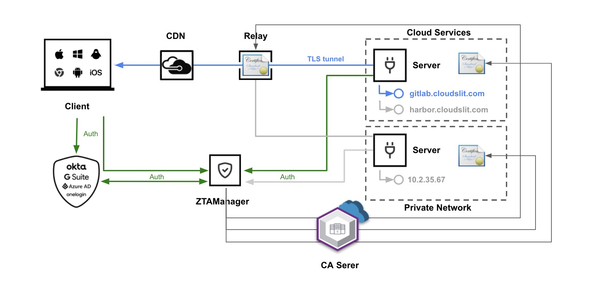

[](https://opensource.org/licenses/Apache-2.0)  [](https://github.com/ztalab/ZACA)

ZAManager is the controller of [ZASentinel](https://github.com/ztalab/ZASentinel)

## Features

- Based on [Gin](https://github.com/gin-gonic/gin)
- Create Resource,Client,Relay,Server
- Apply certificates from [ZACA](https://github.com/ztalab/ZACA)
- Swagger support
- Oauth2

## How does it work

1. Users add their Resource,Client,Relay,Server from ZAManager
2. ZAManager apply certificates from [ZACA](https://github.com/ztalab/ZACA) for each of them
3. Users download program from  [ZASentinel](https://github.com/ztalab/ZASentinel)
4. Config certificates for Client,Relay,Server



## Building

```shell
$ git clone git@github.com:ztalab/ZAManager.git
$ cd ZAManager
$ make
```

You can set GOOS and GOARCH environment variables to allow Go to cross-compile alternative platforms.

The resulting binaries will be in the bin folder:

```shell
$ tree bin
bin
├── ZAManager
```

## Installing

### Docker-compose

~~~shell
cd examples/docker-compose/
vim nginx.conf. line 38,chane you own domain
docker-compose up -d
~~~

This will also install [ZACA](https://github.com/ztalab/ZACA) and [ZAPortal](https://github.com/ztalab/ZAPortal)

Don't forget change  `zta_oauth2 ` table Oauth2 data in mysql with your owns

### Helm

working on it

## License

ZAManager source code is available under the Apache 2.0 [License](https://github.com/ztalab/ZAManager/blob/main/LICENSE).
